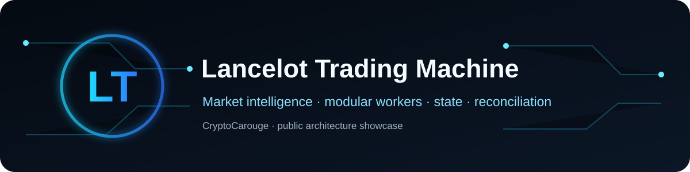
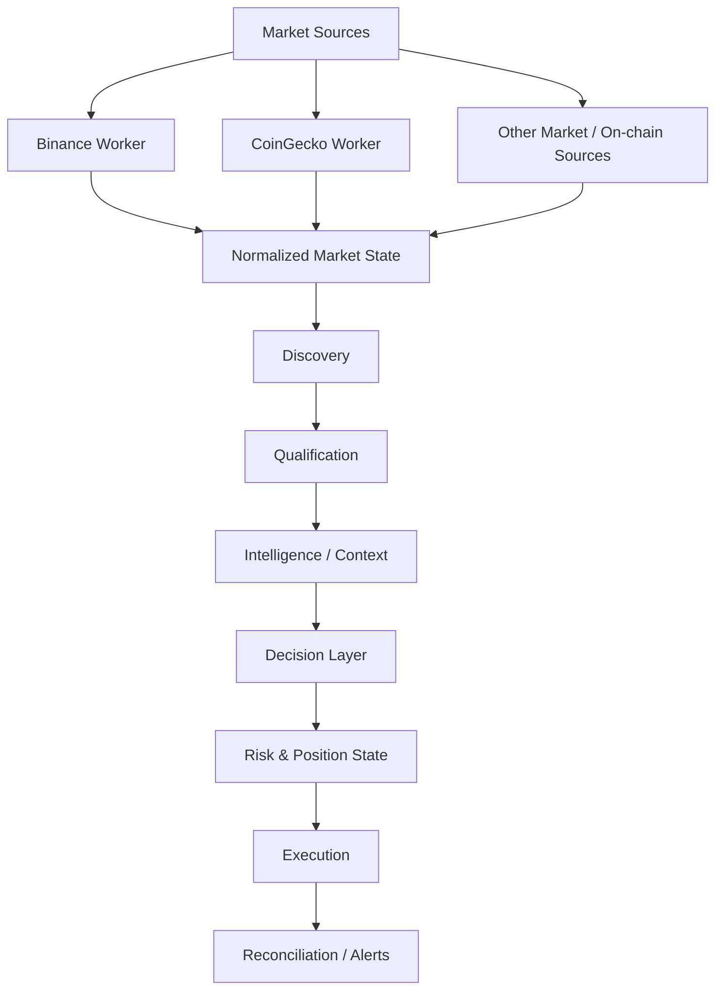

# Lancelot Trading Machine

Public architecture showcase of a private, modular market-intelligence and automation system built with n8n.

The production workflow is intentionally not published. This repository documents the engineering approach without exposing credentials, wallets, private endpoints, execution parameters or proprietary trading logic.

> **Engineering case study:** [architecture decisions, failure modes and privacy boundary](docs/case-study.md)

## What it demonstrates

- Multi-source market-data ingestion
- Dedicated Binance and CoinGecko market workers
- Dynamic market-universe and discovery stages
- Candidate qualification before downstream processing
- Separation between acquisition, decision logic and execution
- Persistent state and position reconciliation
- Operational alerts and Telegram control
- Reporting, retries, cache and rate-limit handling
- Monitoring and degradation detection

## Conceptual architecture

## Worker design

The private system uses dedicated workers rather than forcing every source through one monolithic path.

**Binance Worker:** short-interval data, normalization and cache/state writes.

**CoinGecko Worker:** pair resolution, Solana-pair validation, OHLCV retrieval, rate-limit control and single-flight locking.

The workers are represented here as architecture components rather than separate public repositories.

## Engineering principles

1. **Separate acquisition from decisions.**
2. **Keep state explicit.**
3. **Reconcile internal state with external reality.**
4. **Use retries, locks and degradation alerts for operational resilience.**
5. **Keep sensitive execution rules private.**

## Security boundary

Not published: credentials, wallet identifiers, private webhooks, chat IDs, live Sheet IDs, entry/exit thresholds, position sizing, exact BUY/SELL rules, proprietary prompts/scoring logic or production workflow JSON.

## Disclaimer

Personal engineering project and technical portfolio. Nothing in this repository is financial advice or a recommendation to trade.
